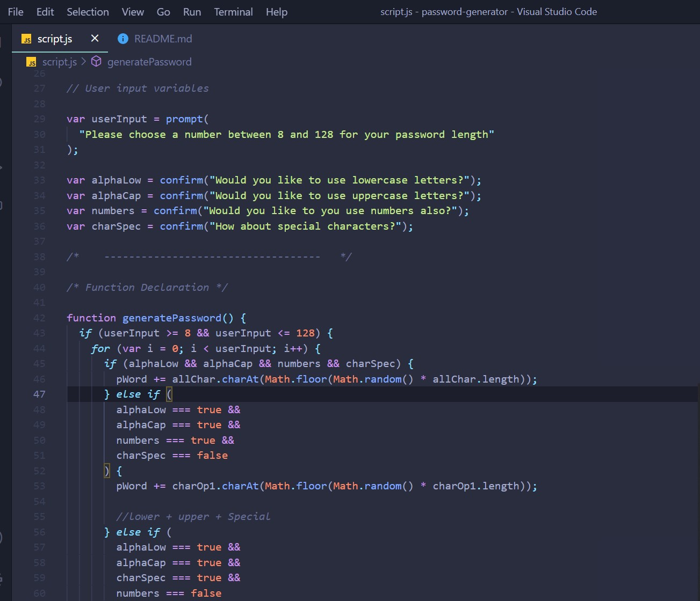

# password-generator

A simple password generator that produces a password form 8 to 128 characters in length. It has the capabilities to add lowercase and uppercase characters, numeric values, and a range of special characters.

## Getting Started

Cloning repository to local directory

1. Open terminal(Mac) or Git Bash(PC)
2. Navigate to prefered directory.
3. Run: **_git clone url_**.
4. Use finder(Mac) or file explorer(PC), and navigate to folder containing downloaded repository.
5. Open folder in code editor of choice.

## Built With

- [HTML](https://developer.mozilla.org/en-US/docs/Web/HTML)
- [CSS](https://developer.mozilla.org/en-US/docs/Web/CSS)
- [JavaScript](https://developer.mozilla.org/en-US/docs/Web/JavaScript)

## Deployed link

- [Live site link](https://jbrown827.github.io/password-generator/)

## Code Snipets



```
function generatePassword() {
  if (userInput >= 8 && userInput <= 128) {
    for (var i = 0; i < userInput; i++) {
      if (alphaLow && alphaCap && numbers && charSpec) {
        pWord += allChar.charAt(Math.floor(Math.random() * allChar.length));
      } else if (
        alphaLow === true &&
        alphaCap === true &&
        numbers === true &&
        charSpec === false
      ) {
        pWord += charOp1.charAt(Math.floor(Math.random() * charOp1.length));
      }


```

# Authors

- **Jaja Brown**
  - [Link to Portfolio]()
  - [Link to GitHub](https://github.com/jbrown827)
  - [Link to LinkedIn](https://www.linkedin.com/in/jaja-brown-a42261201/)

## Acknowledgments
